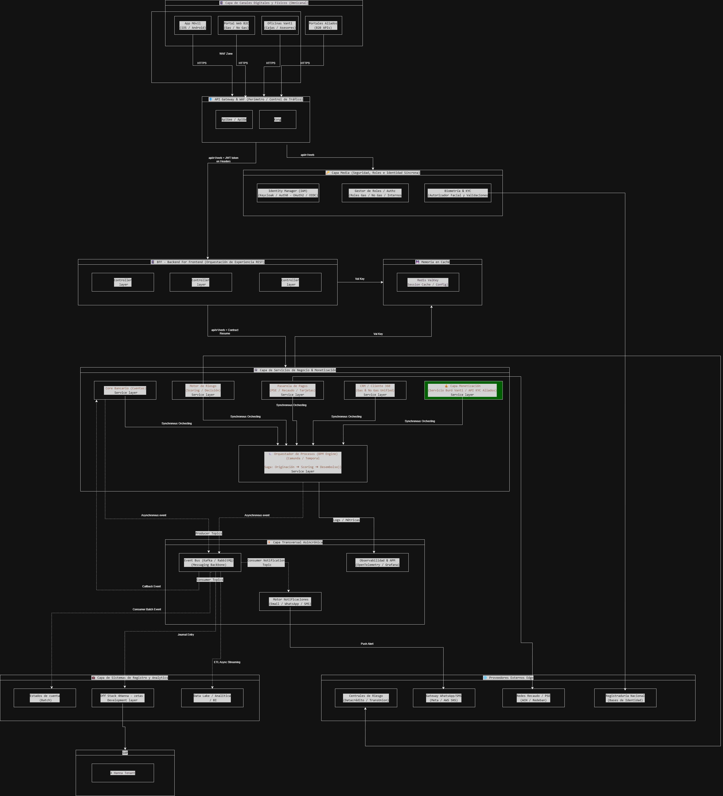
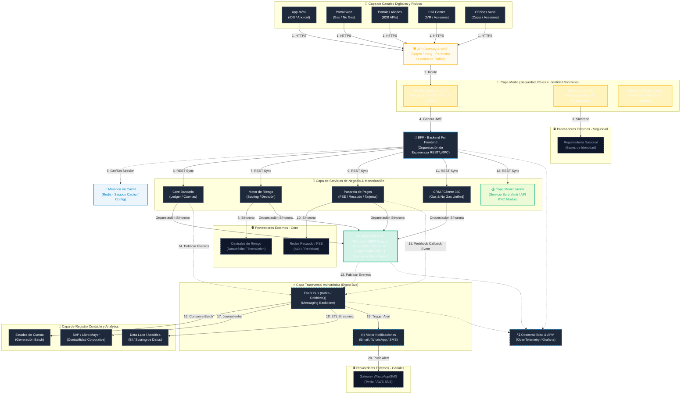

# Entregable 1: Arquitectura de Referencia (HLD) - Ecosistema Financiero

Este documento presenta el diseño de la **Arquitectura de Referencia de Alto Nivel (HLD)** para la plataforma financiera omnicanal del Ecosistema Financiero Integral de **Vanti S.A. ESP**. El diseño es **agnóstico a la nube** (multi-cloud), **orientado a eventos** (Event-Driven) e **híbrido**, estructurado para desacoplar las transacciones críticas en tiempo real de los procesos en lotes (batch) y contabilidad oficial.

---

## 🗺️ 1. Diagrama de Arquitectura Conceptual

### Vista Conceptual de Alto Nivel


### Flujo Lógico de Integraciones (Mermaid)
El siguiente modelo conceptual muestra el desacoplamiento de capas y flujos de integración:



---

## 🏛️ 2. Desglose del Diseño y Justificación de Cambios

### Capa de Acceso y Capa Media (Seguridad, Identidad y Roles)
*   **API Gateway & WAF**: Es la capa de protección y enrutamiento del perímetro. WAF filtra amenazas y el Gateway distribuye el tráfico.
*   **Capa Media (Middleware de Identidad)**: 
    *   *Ubicación*: Se posiciona justo después del API Gateway y antes del BFF (Backend for Frontend).
    *   *Justificación*: La biometría facial, la prueba de vida (KYC) y la gestión de roles no forman parte de la lógica financiera de negocio. Son mecanismos estrictos de **seguridad y control de acceso**. Por lo tanto, se integran en la Capa Media junto al Identity Manager (IAM) y el Autorizador. 
    *   *Comportamiento Síncrono*: Esta capa valida la identidad del usuario consumiendo de manera síncrona el servicio del proveedor biométrico y bases de datos nacionales (Registraduría) antes de generar el token **JWT** que autoriza las transacciones posteriores.

### Capa BFF (Backend for Frontend) y Memoria en Caché (Redis)
*   **BFF**: Traduce las peticiones de los canales en llamadas REST o gRPC síncronas hacia los microservicios core.
*   **Redis (Memoria en Caché)**: 
    *   *Ubicación*: Al lado del BFF y de los microservicios transaccionales.
    *   *Propósito*: Evita sobrecargar las bases de datos transaccionales del Core Bancario y el CRM. Almacena:
        1. Sesiones activas y tokens JWT.
        2. Configuración estática de productos, tasas de interés y parámetros del simulador.
        3. Respuestas de APIs externas de alta frecuencia (como catálogos de bancos o sucursales de recaudo).

### Capa de Servicios de Negocio y Nueva Capa de Monetización
*   **Motor de Riesgo (Scoring Síncrono)**: Para procesos de pre-aprobación y aprobación en línea de créditos, el Motor de Riesgo se comunica de forma síncrona con el **Buró de Crédito Externo (Datacrédito / TransUnion)**. Esto permite tomar decisiones en milisegundos sin depender de una cola de mensajería.
*   **Pasarela de Pagos (PSE / Recaudo)**: Conexión síncrona inicial con las redes de pago (ACH / Redeban) para el flujo de autorización inmediato. El resultado final del pago se gestiona mediante callbacks/webhooks asíncronos.
*   **Capa de Monetización (Valor Agregado)**:
    *   *Servicio de Buró Propio Vanti*: Alimentado del historial interno de comportamiento de pago de facturas de Gas e histórico de comportamiento crediticio No Gas de Vanti, complementado con datos del buró externo. Genera un score propio altamente predictivo que puede ser consultado por aliados externos B2B.
    *   *API KYC Aliados*: Expone el autorizador de biometría y validación de identidad a comercios y portales aliados mediante el cobro de una tarifa por consumo (API-led monetization).

### Capa Transversal Asincrónica (Backbone de Eventos Kafka / RabbitMQ)
*   *Ubicación*: Transversal a todo el sistema.
*   *Justificación*: El Event Bus no es un componente horizontal que deba bloquear el flujo síncrono cliente-servidor. Funciona de manera paralela e integradora.
*   *Operaciones Desacopladas (Event-Driven & Batch)*:
    *   **Estados de Cuenta y Facturación**: Al procesarse un pago o cerrarse un ciclo de facturación, se emite un evento al Bus. El generador de Estados de Cuenta consume este evento y genera el documento en lote (batch) asíncronamente.
    *   **SAP / Contabilidad Oficial**: Las HUs y el BPM emiten eventos de cambios de estado financiero. El conector SAP consume estos eventos y realiza la journalización contable de manera asíncrona mediante colas de persistencia, aislando al Core Bancario de la velocidad del ERP contable.
    *   **Notificaciones**: El orquestador BPM **nunca llama directamente al motor de notificaciones**. En su lugar, el BPM publica el evento `alert.trigger` en el Event Bus. El Motor de Notificaciones (transversal) reacciona a este evento, lee el canal preferido del cliente (WhatsApp, SMS, Email) y hace la entrega a través del proveedor externo (Twilio/AWS SNS) de manera asincrónica.

---

## 🔌 3. Flujos de Transacción Integrados

### Ejemplo: Solicitud y Originación de Crédito No Gas
```
[Cliente] ──(1. Síncrono)──> [API GW & Capa Media]  (Autenticación Biométrica Síncrona ➔ Token JWT)
   │
[BFF] ─────(2. Síncrono)──> [Motor Riesgo / Buró]  (Scoring en Tiempo Real contra Datacrédito)
   │
[BPM] ─────(3. Síncrono)──> [Core Bancario / CRM]  (Apertura de Cuenta y Registro Cliente)
   │
[BPM] ─────(4. Asíncrono)─> [Event Bus (Kafka)] ──> [SAP] (Asiento Contable Asíncrono)
                                        │
                                        └─────────> [Notificaciones] ──> [WhatsApp] ("Crédito Desembolsado")
```
1.  **Autenticación y KYC (Síncrono)**: El cliente realiza la validación biométrica en la App. La **Capa Media** valida síncronamente contra la Registraduría y el IAM genera un token JWT.
2.  **Scoring e Inteligencia (Síncrono)**: El BFF invoca al Motor de Riesgo que consume síncronamente el Buró Externo para dar una pre-aprobación del crédito en segundos.
3.  **Registro y Creación (Síncrono)**: El orquestador **BPM** coordina síncronamente la creación de la cuenta en el Core Bancario y el registro en el CRM.
4.  **Cierre y Registro Contable (Asíncrono)**: Una vez desembolsado el dinero, el BPM publica un evento de transacción exitosa en el **Event Bus (Capa Transversal)**.
    *   El suscriptor de **SAP** toma el evento y genera el registro contable.
    *   El suscriptor de **Notificaciones** toma el evento y dispara un WhatsApp automático de felicitación al cliente.
    *   El suscriptor de **Data Lake** ingesta los datos en tiempo real para actualizar el panel de control del CTO.
